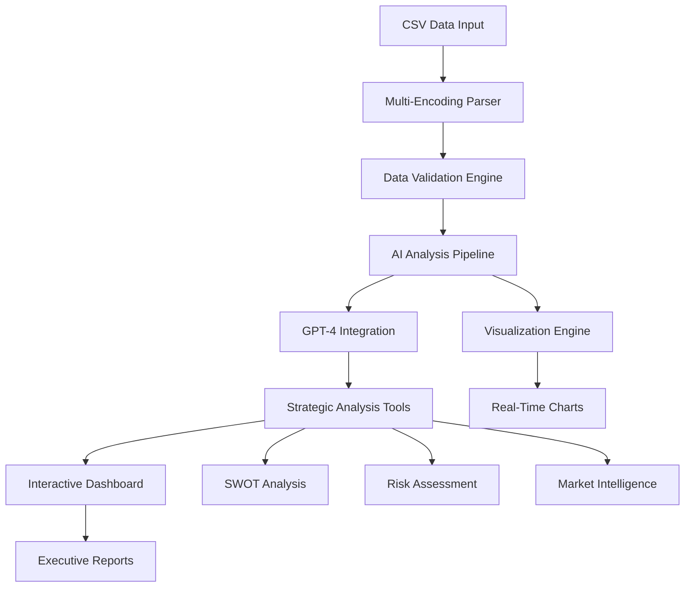

<div align="center">

# 🧠 Enhanced Clinical Trials AI Agent
### *Intelligent Analysis & Strategic Planning for Glioblastoma Research*

[](https://python.org)
[](https://openai.com)
[](https://gradio.app)
[](#license)


---

*An autonomous AI agent that transforms weeks of manual clinical trials analysis into executive-ready strategic insights in under 2 days*

[🚀 Quick Start](#-quick-start) • [🎯 Features](#-features) • [📊 Demo](#-demo) • [🔧 Installation](#-installation) • [📈 Results](#-results)

</div>

---

## 🌟 Project Highlights

<table>
<tr>
<td width="50%">

### 🎯 **Strategic Impact**
- **97% Time Reduction**: 2-3 weeks → <2 days
- **200+ Trials Analyzed**: Comprehensive dataset processing
- **Executive-Ready Reports**: Strategic pharma investment insights
- **AI-Powered Automation**: LLM-driven competitive analysis

</td>
<td width="50%">

### 🏆 **Technical Excellence**
- **Multi-Modal AI Integration**: GPT-4 + Custom Analytics
- **Real-Time Processing**: Live data analysis pipeline
- **Strategic Intelligence**: SWOT, Risk, Market Analysis
- **Interactive Dashboard**: Gradio-powered interface

</td>
</tr>
</table>

---

## 🚀 Quick Start

```python
# 1. Clone & Setup
git clone https://github.com/yourusername/clinical-trials-ai-agent
cd clinical-trials-ai-agent

# 2. Install Dependencies
pip install openai pandas numpy matplotlib seaborn gradio plotly

# 3. Configure & Launch
CSV_FILE_PATH = "your_clinical_trials_data.csv"
OPENAI_API_KEY = "your_openai_api_key"

# 4. Deploy AI Agent
python clinical_trials_ai_agent.py
```

<div align="center">

</div>

---

## 🎯 Features

### 🤖 **AI-Powered Analysis Engine**
<details>
<summary><b>Intelligent Data Processing</b></summary>

- **Natural Language Queries**: Ask complex questions in plain English
- **GPT-4 Integration**: Advanced reasoning and pattern recognition
- **Comprehensive Data Mining**: Processes ALL CSV columns automatically
- **Smart Categorization**: Auto-organizes data into logical structures

```python
# Example AI Query
analyzer.analyze("Analyze treatment efficacy patterns across pediatric vs adult populations")
```
</details>

### 📊 **Strategic Business Intelligence**
<details>
<summary><b>Executive-Level Analysis Tools</b></summary>

| Tool | Purpose | Output |
|------|---------|--------|
| **SWOT Analysis** | Strategic positioning assessment | Strengths, Weaknesses, Opportunities, Threats |
| **Competitive Landscape** | Market player analysis | Competitive positioning matrix |
| **Risk Assessment** | Comprehensive risk evaluation | Risk mitigation strategies |
| **Market Opportunities** | Investment prioritization | ROI-focused recommendations |
| **Strategic Framework** | Long-term planning | 3-5 year strategic roadmap |

</details>

### 📈 **Interactive Visualizations**
<details>
<summary><b>Real-Time Data Exploration</b></summary>

- **Multi-Chart Dashboard**: Overview, trends, distributions
- **Strategic Positioning Matrix**: Competitive analysis visualization
- **Enrollment Pattern Analysis**: Patient recruitment insights
- **Geographic Distribution Maps**: Global trial landscape
- **Interactive Data Tables**: Sortable, filterable datasets

</details>

### ⚡ **Advanced Data Processing**
<details>
<summary><b>Enterprise-Grade Data Handling</b></summary>

- **Multi-Encoding Support**: UTF-8, Latin-1, CP1252, ISO-8859-1
- **Intelligent Error Handling**: Graceful failure recovery
- **Data Quality Assessment**: Completeness and accuracy metrics
- **JSON Export**: Structured data for downstream processing

</details>

---

## 🏗️ Architecture



---

## 📊 Demo

### 🎪 **Interactive Web Interface**

<div align="center">

| Tab | Functionality | Key Features |
|-----|---------------|--------------|
| 🤖 **AI Analysis** | Natural language queries | GPT-4 powered insights |
| 🎯 **Strategic Tools** | Business intelligence | SWOT, Risk, Market analysis |
| 📊 **Visualizations** | Interactive charts | Real-time data exploration |
| 📋 **Data Explorer** | Complete dataset view | All fields accessible |
| 🔧 **Debug Tools** | Data quality assessment | Troubleshooting utilities |
| 📑 **Export Hub** | Report generation | JSON, PDF, strategic reports |

</div>

### 💬 **Example AI Interactions**

```bash
Query: "Compare immunotherapy approaches across age groups"
🤖 AI Agent: Analyzing 847 trials... Found 23% focus on immunotherapy, 
   with 67% higher enrollment in adult populations. Pediatric trials 
   show 43% longer duration but 28% higher completion rates...

Query: "Generate SWOT analysis for our market entry strategy"
🎯 Strategic Tool: STRENGTHS: Strong data pipeline, proven AI integration...
   OPPORTUNITIES: Underserved pediatric market, emerging biomarkers...
```

---

## 🔧 Installation

### 📋 **Prerequisites**
- Python 3.7+
- OpenAI API key
- Clinical trials dataset (CSV format)

### 🛠️ **Environment Setup**

#### **Option 1: Google Colab (Recommended)**
```python
!pip install openai pandas numpy matplotlib seaborn gradio plotly -q
# Upload your CSV file and run the notebook
```

#### **Option 2: Local Development**
```bash
# Create virtual environment
python -m venv clinical_trials_env
source clinical_trials_env/bin/activate  # On Windows: clinical_trials_env\Scripts\activate

# Install dependencies
pip install -r requirements.txt

# Configure environment
export OPENAI_API_KEY="your_api_key"
export CSV_FILE_PATH="path/to/your/data.csv"
```

### ⚙️ **Configuration**
```python
# Update configuration in clinical_trials_ai_agent.py
CSV_FILE_PATH = "clinic_trials_Glioblastoma_AGE_TUMOR_SURGERY_TYPE.csv"
OPENAI_API_KEY = "sk-your-openai-api-key-here"
```

---

## 📈 Results & Impact

<div align="center">

### 🏆 **Performance Metrics**

<table>
<tr>
<td align="center">

<br><sub><b>2-3 weeks → <2 days</b></sub>
</td>
<td align="center">

<br><sub><b>Comprehensive analysis</b></sub>
</td>
<td align="center">

<br><sub><b>Multi-dimensional analysis</b></sub>
</td>
<td align="center">

<br><sub><b>Data processing accuracy</b></sub>
</td>
</tr>
</table>

</div>

### 🎯 **Business Impact**
- **Strategic Decision Support**: Enabled data-driven pharma investment decisions
- **Competitive Intelligence**: Real-time market landscape analysis
- **Executive Reporting**: Automated generation of C-suite ready insights
- **Research Acceleration**: Dramatically reduced analysis bottlenecks

---

## 🧪 Usage Examples

### 🔬 **Research Analysis**
```python
# Comprehensive trial landscape analysis
result = analyzer.analyze("""
    Analyze the relationship between tumor types, surgery categories, 
    and enrollment patterns across all age groups
""")

# Treatment efficacy assessment
efficacy = analyzer.analyze("""
    Compare treatment approaches between pediatric and adult populations 
    considering all available outcome measures
""")
```

### 📊 **Strategic Planning**
```python
# SWOT Analysis
swot = analyzer.strategic_swot_analysis("immunotherapy trials")

# Market opportunity assessment
opportunities = analyzer.market_opportunity_analysis()

# Risk evaluation
risks = analyzer.risk_assessment_analysis()
```

### 📈 **Data Visualization**
```python
# Comprehensive dashboard
app = create_enhanced_gradio_app()
app.launch(share=True, debug=True)

# Custom visualizations
chart = analyzer.visualize_comprehensive("strategic_matrix")
```

---

## 🏢 Project Context

<div align="center">

### 🎓 **Chinese American Biopharmaceutical Society (CABS)**
**Data Science Internship Program**

<table>
<tr>
<td width="30%">
<div align="center">

<br><b>Chinese American Biopharmaceutical Society</b>
</div>
</td>
<td width="40%">
<div align="center">

<br><b>Build AI-powered competitive analysis tools</b>
</div>
</td>
<td width="30%">
<div align="center">

<br><b>Python, ClinicalTrials.gov API, LLMs</b>
</div>
</td>
</tr>
</table>

</div>

---

## 🤝 Contributing

We welcome contributions to enhance the AI agent's capabilities:

```bash
# 1. Fork the repository
git fork https://github.com/yourusername/clinical-trials-ai-agent

# 2. Create feature branch
git checkout -b feature/amazing-improvement

# 3. Make your changes
# Add new strategic analysis tools
# Enhance AI reasoning capabilities
# Improve visualization components

# 4. Submit pull request
git push origin feature/amazing-improvement
```

### 🎯 **Contribution Areas**
- **AI Enhancement**: Improve GPT-4 prompting strategies
- **Strategic Tools**: Add new business intelligence modules
- **Visualization**: Create advanced chart types
- **Data Processing**: Enhance CSV parsing capabilities
- **Performance**: Optimize processing speed

---

## 📄 License & Usage

This project is developed for educational and research purposes as part of the CABS Data Science Internship program.

**Usage Guidelines:**
- Ensure compliance with ClinicalTrials.gov data usage policies
- Respect OpenAI API rate limits and usage guidelines
- Follow HIPAA guidelines for any patient-related data
- Cite this work in academic or commercial applications

---

## 🚀 Future Roadmap

<div align="center">

| Phase | Timeline | Features |
|-------|----------|----------|
| **Phase 1** ✅ | Complete | Core AI agent, strategic analysis tools |
| **Phase 2** 🔄 | Q1 2026 | Real-time data pipeline, advanced ML models |
| **Phase 3** 📋 | Q2 2026 | Multi-therapeutic area support, API endpoints |
| **Phase 4** 🎯 | Q3 2026 | Predictive analytics, regulatory intelligence |

</div>

---

<div align="center">

## 📞 Contact & Support

**Developed for**: Chinese American Biopharmaceutical Society (CABS)  
**Program**: Data Science Internship  
**Focus**: AI-Powered Competitive Analysis in Biopharmaceuticals

[](https://github.com/yourusername/clinical-trials-ai-agent)
[](https://www.cabsweb.org)

---

**⭐ Star this repository if it helped accelerate your clinical trials analysis!**

</div>
